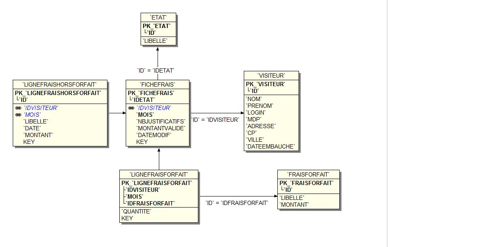
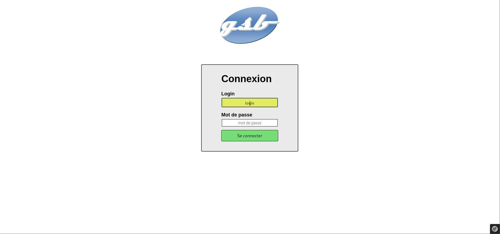
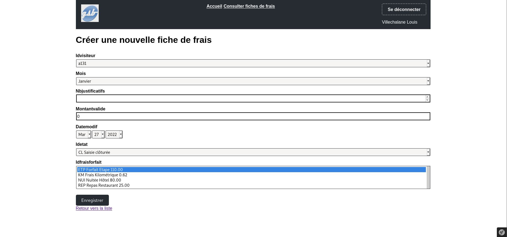
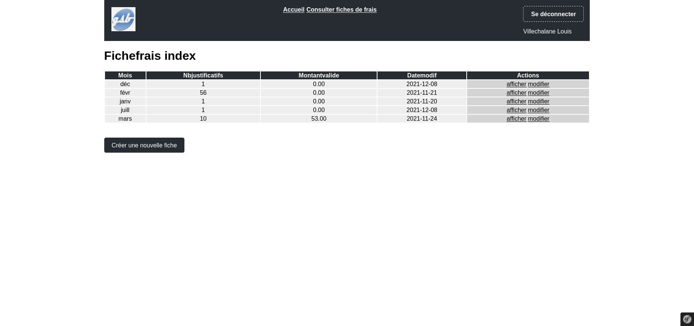

# GSB-Frais
Application Web de gestion de frais (Symfony)

### Modélisation de la base de données

### Captures d'écrans de l'application web

| Page de connexion | Créer une fiche de frais | Liste des fiches de frais |
| :----------: | :------------: | :-------------: |
|  |  | 

### Description des cas d’utilisations

| **Se connecter** | 
| :------------- | 
| Acteur déclencheur : Visiteur médical |
| Pré-conditions : néant |
| Post-conditions : Le visiteur est connecté |
|   |
| **Scénario nominal :**   
1 - Le système affiche un formulaire de connexion.
2 - L'utilisateur saisit son login et son mot de passe puis valide.
3 - Le système contrôle les iformations de connexion, informe que le profil est activé et maintient affichée l'identité du visiteur connecté.
|   |
| **Exceptions :**
3-a : Le nom et/ou le mot de passe est invalide.
  3-a.1 Le système en informe l'utilisateur; retour à l'étape 1
4 - L'utilisateur demande à se déconnecter.
5 - Le système déconnecte l'utilisateur

  

| **Consulter mes fiches de frais** | 
| :------------- | 
| Acteur déclencheur : Visiteur médical |
| Pré-conditions : Visiteur identifié |
| Post-conditions : néant |
|   |
| **Scénario nominal :**   
1 - L'utilisateur demande à consulter ses frais.
2 - Le système invite à sélectionner un mois donné.
3 - L'utilisateur sélectionne un mois donné, puis valide.
4 - Le système affiche l'état de la fiche de frais avec la date associée, les élements forfaitisés, la quantité pour chhaque type de frais forfaitisé et non forfaitisés, le montant, le libellé et la date d'engagement existant pour la fiche de frais du mois demandé.

  

| **Renseigner une fiche de frais** | 
| :------------- | 
| Acteur déclencheur : Visiteur médical |
| Pré-conditions : Le visiteur est connecté |
| Post-conditions : néant |
|   |
| **Scénario nominal :**   
1 - L'utilisateur demande à saisir un ou plusieurs frais pour le mois courant.
2 - Le système retourne les frais actuellement saisis, les élements forfaitisés et hors forfait pour le mois courant.
3 - Lutilisateur modifie une ou des valeurs des frais au forfait et demande la validation.
4 - Le système enregistre cette ou ces modifications et retourne ces valeurs à jour.
5 - L'utilisateur ajoute un noveau frais hors forfait en renseignant les différents champs.
6 - Le système enregistre la ligne de frais hors forfait.
|   |
| **Exceptions :**
2.a - C'est la première saisie pour le mois courant. Si ce n'est pas encore fait, le système clôt la fiche du mois précédent et crée une nouvelle fiche de frais avec des valeurs initialisées à 0. Retour à l'étape 3.
4.a - Une valeur modifiée n'est pas numérique : le système indique 'Valeur numérique attendue'. Retour à l'étape 3.
6.a - Un des chamos n'est pas renseigné : le système indique : 'Le champs [nom du champs] doit être renseigné'
6.b - La date d'enregistrement des frais hors forfait est invalide : le système indique 'La date d'enregistrement doit être valide'. Retour à l'étape 5.
6.c - La date d'enregistrement des frais hors forfait date de plus d'un an. Le système indique 'La date d'engagement doit se situer dans l'année écoulée'. Retour à l'étape 5.
7 - L'utilisateur sélectionne un frais hors forfait pour suppresion.
8 - Le système enregistre cette suppresion après une demande de confirmation.
